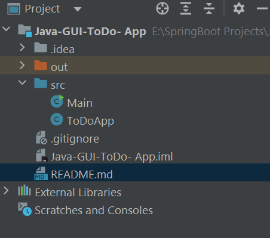

# 📝 Java Swing To-Do App

A simple **To-Do List Application** built using **Java Swing**.  
This project demonstrates basic GUI development in Java with features to **add** and **delete** tasks.

---

## 🚀 Features
- Add new tasks using text field + "Add Task" button.
- Delete selected tasks using "Delete Task" button.
- Scrollable task list using `JList` and `JScrollPane`.
- Simple and beginner-friendly code structure.

---

## 🛠️ Tools & Technologies
- **Java** (JDK 8 or higher recommended)
- **Swing** (built-in Java GUI library)
- **IntelliJ IDEA CE** or **Eclipse**

---

## 📂 Project Structure

---

---

## ▶️ How to Run
1. Clone or download this repository.
2. Open project in **IntelliJ IDEA** or **Eclipse**.
3. Inside `src`, run **Main.java**.
4. A GUI window will open where you can:
    - Enter a task in the text field and click **Add Task**.
    - Select a task from the list and click **Delete Task**.

---

## 📸 Screenshot (Optional)
_Add a screenshot here if you want_

---

## 📖 Future Improvements
- Save tasks permanently (file/database).
- Mark tasks as completed (checkbox).
- Add "Clear All" option.
- Improve UI design with colors and fonts.

---

## 👨‍💻 Author
- Developed by **[Ankit Karodiya]**

